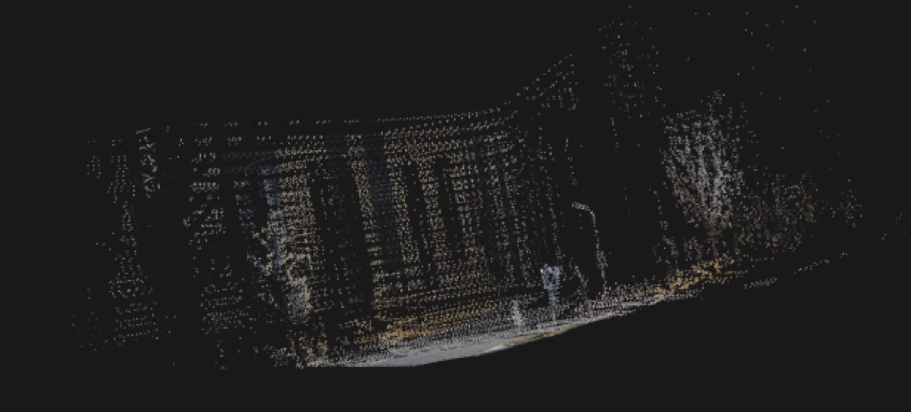
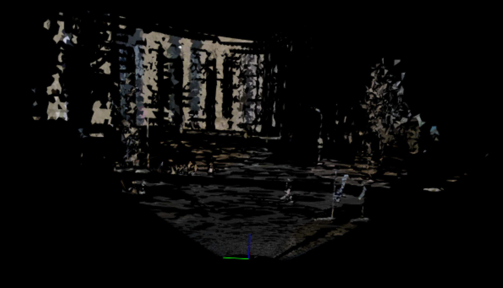
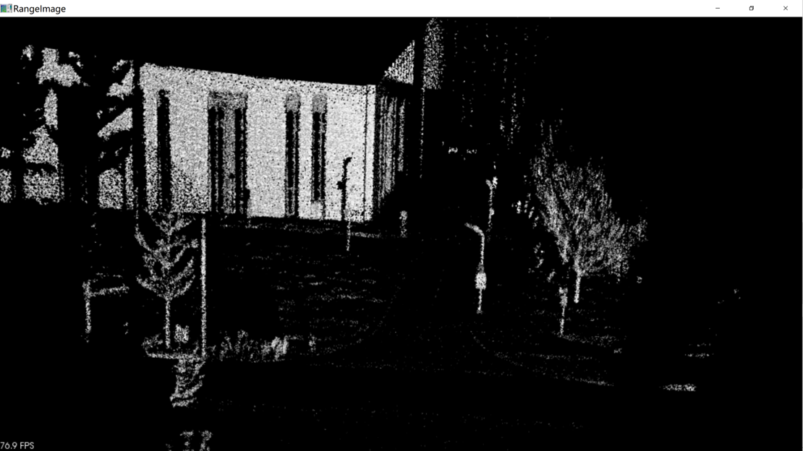

# PCL库三维重建
## 一、介绍
1. 利用C++ PCL库对KITTI数据集进行三维重建
2. 利用livox激光雷达和hikvision相机进行三维重建

## 二、环境：
VS2017 + PCL1.8.1

## 三、实验步骤：
### 3.1 KITTI三维重建
1. 用KITTI的配准信息将点云投影到图像上获得真彩色点云
2. 滤波  
3. 重采样平滑 
4. 法线计算 
5. 将点云坐标、颜色、法线信息合在一起 
6. 网格化（贪心三角化）

### 3.2 Livox-hikvision三维重建
1. 读取.lvx文件，转换成pcd文件
2. 读取hikvision拍摄视频
3. 后续方法同2.1
4. **补充**：利用深度图进行网格化

## 四、结果:
### 4.1 贪婪投影三角法网格化
### 1. 真彩色点云(KITTI)

### 2. 贪婪投影三角化(KITTI)

### 3. 真彩色点云(lvx-5帧30000点)

### 4. 贪婪投影三角化(lvx-5帧30000点)

随着处理帧数的增多，网格会更加致密，空洞会减少，但后续仍需要进行网格修复(mesh repair)，才能得到较好的重建结果。

### 4.2 深度图网格化

### 1. 用点云生成深度图(200帧，240万点)

### 2. 用深度图进行网格化

## 五、总结
1. 计算法线前，可以用MovingLeastSquares或者BilateralUpsampling让点云变得更加稠密，从而在曲面重建中有更好的逼近，更少的孔洞。
2. 法线估计可以使用radius search或者K-neighbour search。

## 六、参考
[1] 解析.lvx文件代码参考[pylvx](https://github.com/Jaesirky/pylvx)

[2] [https://stackoverflow.com/questions/32362891/pcl-greedyprojectiontriangulation-makes-not-enough-faces](https://stackoverflow.com/questions/32362891/pcl-greedyprojectiontriangulation-makes-not-enough-faces)