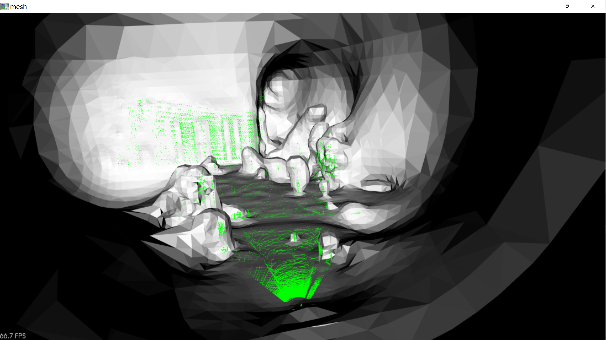
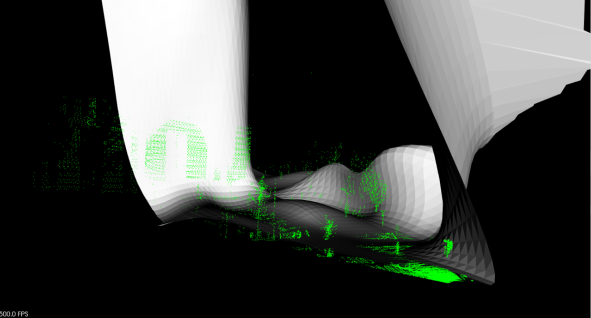
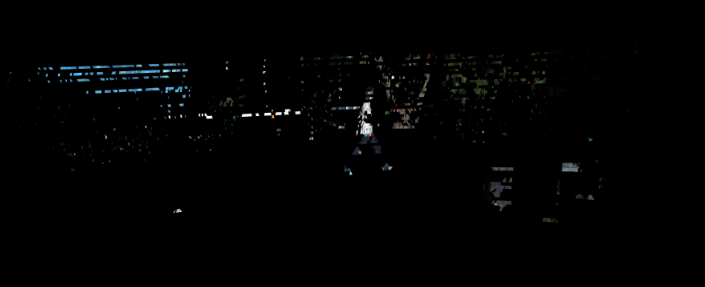
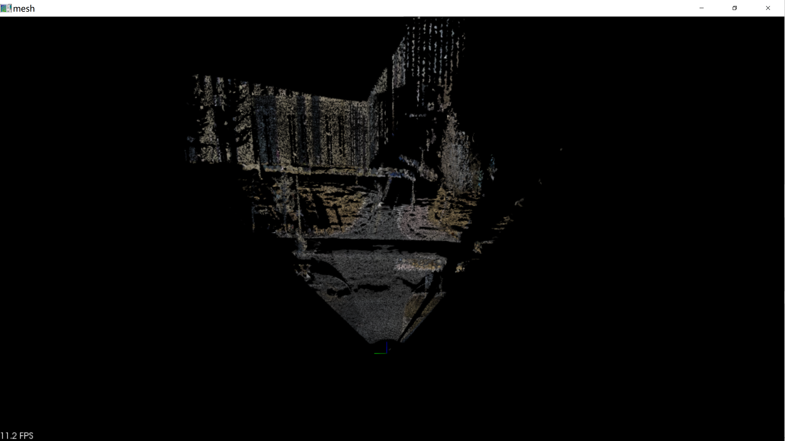
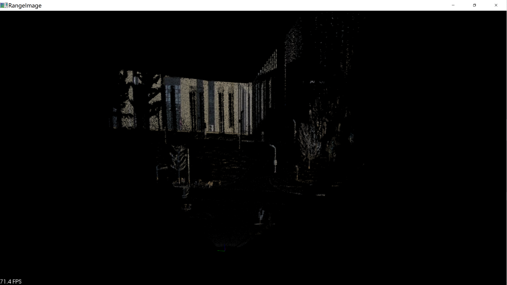

# PCL库三维重建
## 一、介绍
1. 利用C++ PCL库对KITTI数据集进行三维重建
2. 利用livox激光雷达和hikvision相机进行三维重建

## 二、依赖库：
PCL1.8.1 + OpenCV + PythonLibs

## 三、实验步骤：
### 3.1 KITTI三维重建
1. 用KITTI的配准信息将点云投影到图像上获得真彩色点云
2. 滤波  
3. 重采样平滑 
4. 法线计算 
5. 将点云坐标、颜色、法线信息合在一起 
6. 网格化（贪心投影三角化，Poisson重建）

### 3.2 Livox-hikvision三维重建
1. 读取.lvx文件，转换成pcd文件
2. 读取hikvision拍摄视频
3. 后续方法同2.1
4. **补充**：利用深度图进行网格化，用B-样条曲线进行网格化(效果较差，且速度慢)

## 四、结果:
### 4.1 Poisson重建和样条重建
Poisson重建和样条重建都利用了流形假设，使用曲面拟合点云。这种方法对watertight物体、满足流形假设(平滑)的物体比较适用，对于需要刻画尖锐特征的三维重建不太适合。

与其它基于插值的方法相比，Poisson重建和样条重建的优点在于输出的网格占用空间要小得多。此外Poisson重建与样条重建相比要更快，很多offline的3D建模软件(比如[OpenDroneMap](https://github.com/geraldmwangi/OpenDroneMap) )都会选择Poisson重建算法。

#### 1. 泊松重建

#### 2. B样条重建

### 4.2 贪婪投影三角法网格化

#### 1. 贪婪投影三角化(KITTI)

#### 2. 贪婪投影三角化(240万点)

随着处理帧数的增多，网格会更加致密，空洞会减少，但后续仍需要进行网格修复(mesh repair)，才能得到较好的重建结果。

### 4.3 深度图网格化

#### 1. 用点云生成深度图(240万点)

#### 2. 用深度图进行网格化

## 五、总结
曲面重建算法可分为插值法和逼近法，其中贪婪投影三角化属于插值法，B-样条重建、Poisson重建、深度图重建均为逼近法。

在重建效果上，贪婪投影三角法和基于深度图的重建算法效果较好。贪婪投影三角法噪声较多，
可以在计算法线前用移动最小二乘法(MLS)重采样平滑和上采样增加点云密度；而基于深度图的重建的网格效果更致密，美中不足的是在纵向有较大距离改变的地方(道路)，深度图方法的网格几乎没有生成，
这和深度图的分辨率有较大关系。

## 六、参考
[1] 解析.lvx文件代码参考[pylvx](https://github.com/Jaesirky/pylvx)

[2] [OpenDroneMap 开源代码](https://github.com/geraldmwangi/OpenDroneMap)

[3] [poisson重建-后处理](https://blog.csdn.net/u012750702/article/details/53351941)

