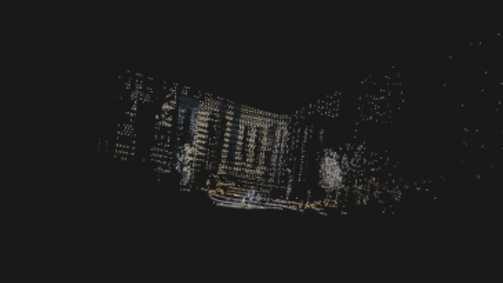

# PCL库三维重建
## 一、介绍
1. 利用C++ PCL库对KITTI数据集进行三维重建
2. 利用livox激光雷达和hikvision相机进行三维重建

## 二、环境：
VS2017 + PCL1.8.1

## 三、实验步骤：
### 3.1 KITTI三维重建
1. 用KITTI的配准信息将点云投影到图像上获得真彩色点云
2. 滤波  
3. 重采样平滑 
4. 法线计算 
5. 将点云坐标、颜色、法线信息合在一起 
6. 网格化（贪心三角化）

### 3.2 Livox-hikvision三维重建
1. 读取.lvx文件，转换成pcd文件
2. 读取hikvision拍摄视频
3. 后续方法同2.1

## 四、结果:
### 1. 真彩色点云(KITTI)

### 2. 贪婪投影三角化(KITTI)

### 3. 真彩色点云(lvx-一帧6000点)

## 五、参考
[1] 解析.lvx文件代码参考[pylvx](https://github.com/Jaesirky/pylvx)
